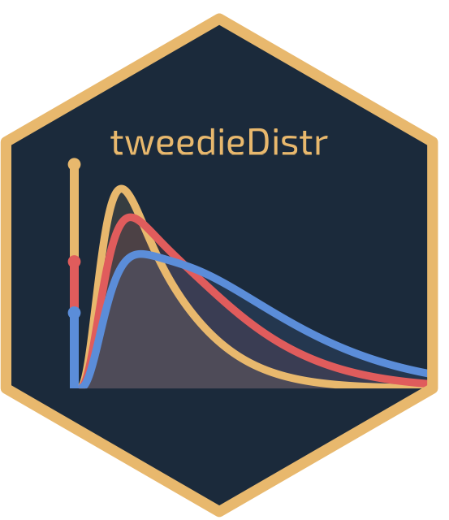

<!-- README.md is generated from README.Rmd. Please edit that file -->

```{r, include = FALSE}
knitr::opts_chunk$set(
  collapse = TRUE,
  comment = "#>",
  fig.path = "man/figures/README-",
  out.width = "100%"
)
```

# tweedieDistr: fast evaluation of the Tweedie distribution <a href="https://github.com/StefanoDamato/tweedieDistr/"></a>

<!-- badges: start -->
[](https://github.com/StefanoDamato/tweedieDistr/actions/workflows/R-CMD-check.yaml)
[](https://app.codecov.io/gh/StefanoDamato/tweedieDistr)
[](https://CRAN.R-project.org/package=tweedieDistr)
[](https://lifecycle.r-lib.org/articles/stages.html#experimental)
[](https://www.gnu.org/licenses/lgpl-3.0)
<!-- badges: end -->

`tweedieDistr` provides density, distribution function, quantile function, and random generation for the **Tweedie distribution** under the compound Poisson-Gamma parameterisation with power parameter $p \in (1, 2)$.
The Tweedie family naturally combines a point mass at zero with a continuous positive component, making it well suited to intermittent demand data and any setting where exact zeros occur alongside strictly positive observations.

## Exported functions

We provide four `stats`-like functions:

* `dtweedie()`: probability density function via the series expansion of Dunn & Smyth (2005).
* `ptweedie()`: cumulative distribution function using a truncated compound Poisson-Gamma summation.
* `qtweedie()`: quantile function via Newton-Raphson algorithm, with a fallback to bisection.
* `rtweedie()`: random generation via the exact compound Poisson--Gamma representation.

## Installation

You can install the **stable** version from CRAN:

```r
install.packages("tweedieDistr")
```

You can install the **development** version from
[GitHub](https://github.com/StefanoDamato/tweedieDistr):

```r
# install.packages("devtools")
devtools::install_github("StefanoDamato/tweedieDistr")
```

## Usage

### Standard `stats`-style interface

The four `dtweedie` / `ptweedie` / `qtweedie` / `rtweedie` functions mirror
the conventions of base R distribution functions and support vectorised
arguments.

```{r stats-style}
library(tweedieDistr)

# density at a few points
dtweedie(c(0, 1, 2, 3), mean = 1, dispersion = 2, power = 1.2)

# cumulative probabilities
ptweedie(c(0, 1, 2, 3), mean = 1, dispersion = 2, power = 1.2)

# quantiles
qtweedie(c(0.25, 0.5, 0.75, 0.9), mean = 1, dispersion = 2, power = 1.2)

# random samples
rtweedie(4, mean = 1, dispersion = 2, power = 1.2)
```

## Mathematical background

The Tweedie distribution $$Y \sim \mathrm{Tw}(\mu, \phi, \rho)$$ with power $p \in (1, 2)$ is a compound Poisson-Gamma
variable: $Y = \sum_{i=1}^{N} G_i$, where

$$N \sim \mathrm{Poisson}(\lambda), \qquad
G_i \sim \mathrm{Gamma}(\alpha, \beta),$$

with

$$\lambda = \frac{\mu^{2-p}}{\phi(2-p)}, \quad
\alpha = \frac{2-p}{p-1}, \quad
\beta = \frac{1}{\phi(p-1)\mu^{p-1}}.$$

The distribution has mean $\mu$ and variance $\phi\mu^p$. When $N = 0$ the sum
is conventionally defined as zero, giving a point mass $P(X = 0) =
e^{-\lambda}$. The density for $x > 0$ is evaluated via the series expansion
of Dunn & Smyth (2005), implemented in C++ through
[Rcpp](https://www.rcpp.org/) and
[RcppArmadillo](https://github.com/RcppCore/RcppArmadillo).

## Contributors

<!-- prettier-ignore-start -->
<!-- markdownlint-disable -->
<table>
<tbody>
<tr>
<td align="center" valign="top" width="20%">
<a href="#">
<br />
<sub><b>Stefano Damato</b></sub></a><br /> <sub>(Maintainer)</sub><br />
<a href="mailto:stefano.damato@supsi.ch?subject=[tweedieDistr package]">Email</a>
</td>
</tr>
</tbody>
</table>
<!-- markdownlint-restore -->
<!-- prettier-ignore-end -->

## Getting help

If you encounter a bug, please file a minimal reproducible example on
[GitHub](https://github.com/StefanoDamato/tweedieDistr/issues).

## References

Dunn, P. K., & Smyth, G. K. (2005). Series evaluation of Tweedie exponential
dispersion model densities. *Statistics and Computing*, 15(4), 267--280.
<https://doi.org/10.1007/s11222-005-4070-y>.
